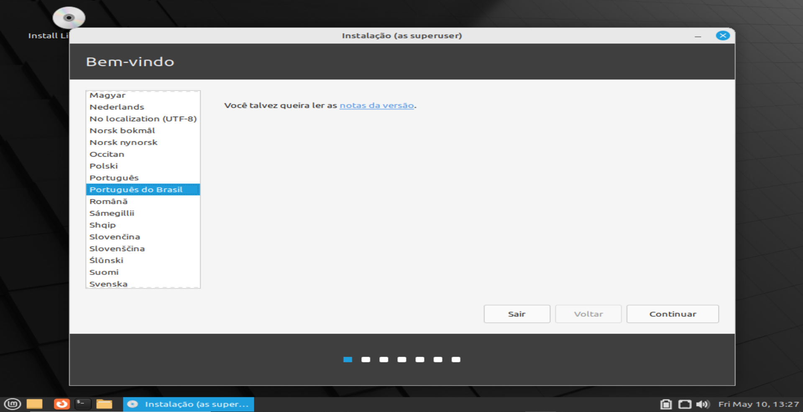
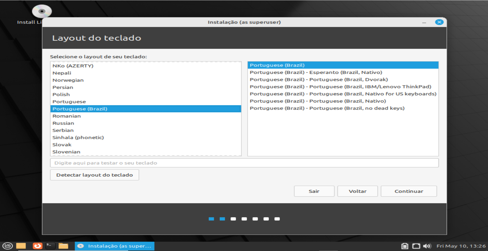
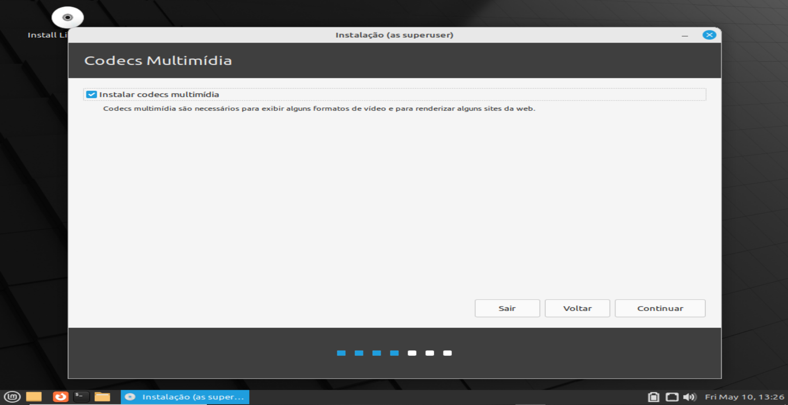
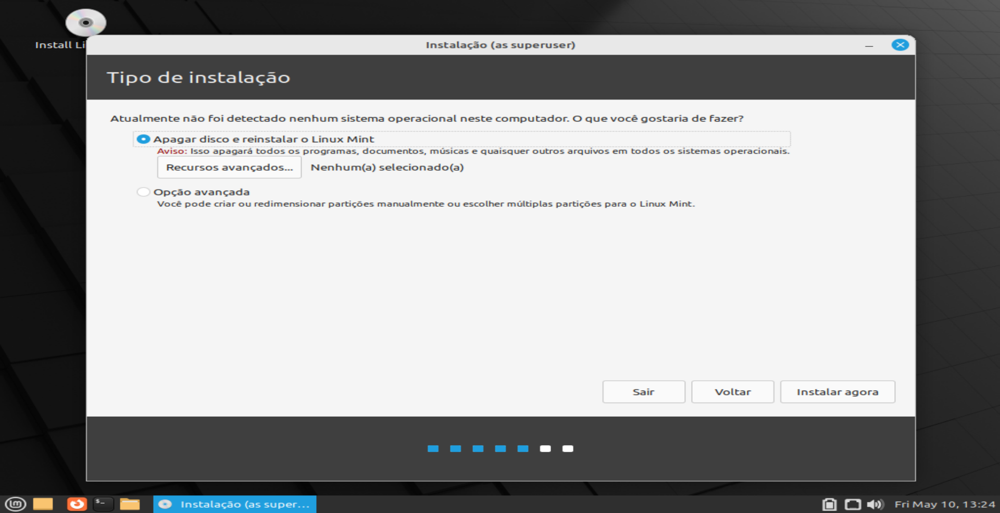
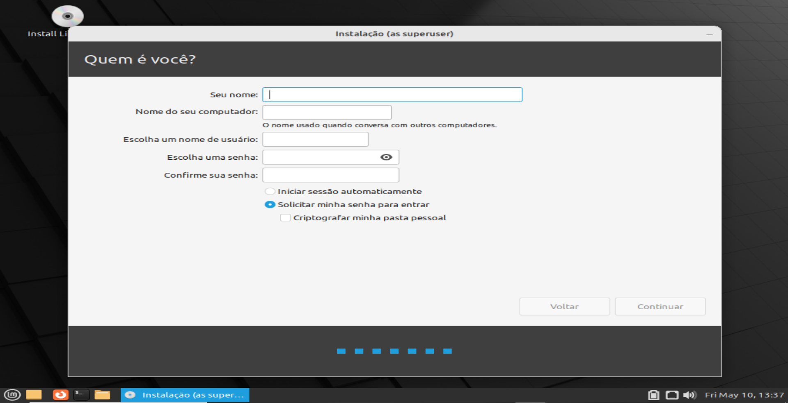
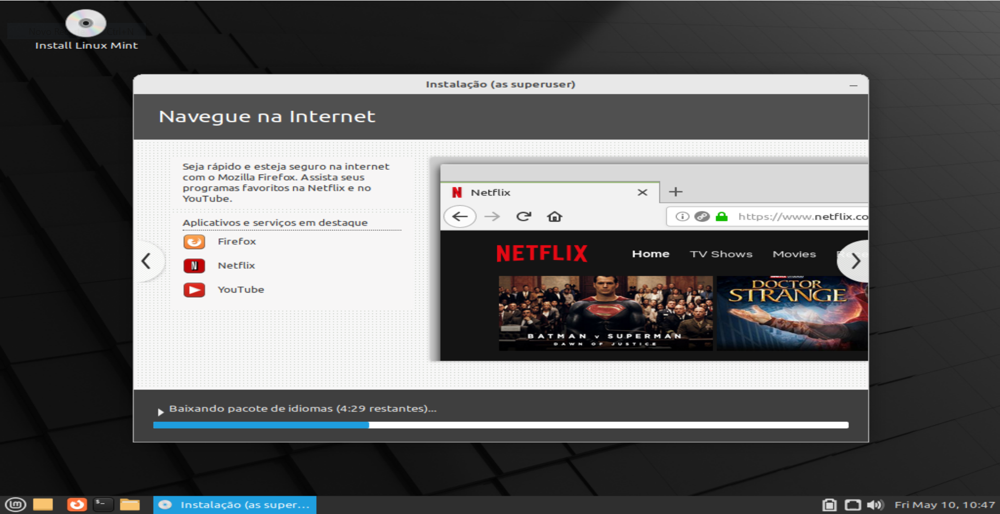
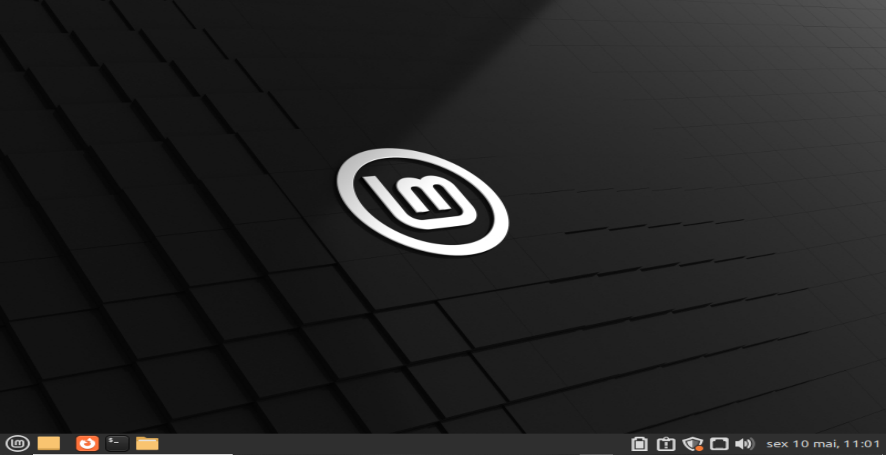

# LINUXMINT
## Passo a Passo de como instalar o sistema operacional LinuxMint
### Preste bastante atenção nos passos, para que não de nada errado!
 
## O Linux Mint é um sistema operacional para computadores, projetado para funcionar na maioria dos sistemas computacionais modernos. O Linux Mint cumpre as mesmas funções que os sistemas operacionais Microsoft Windows, Mac OS da Apple, e o Free BSD.
 
## MANUAL- INSTALAÇÃO DO SISTEMA OPERACIONAL LINUX MINT
 
### 1- Acesse o site oficial do Linux Mint e baixe a versão desejada do sistema operacional no botão escrito “download”;

 
### 2- Assim que baixar e abrir uma tela de fundo preto com a logo do Linux Mint, clique no ícone de CD no canto superior esquerdo da tela, escrito embaixo “Install Linux Mint”;
 
### 3- Ao clicar, aparecerá uma tela escrito “Welcome” que significa “Bem-vindo”, e logo abaixo possui inúmeras opções de idiomas para o seu computador. Selecione a linguagem desejada para configurar o idioma do PC e clique em “Continuar” no canto inferior direito;

 
 
### 4- Logo após aparecerá a tela de “Layout do teclado”, este é o lugar onde será configurado o teclado do seu computador. Selecione o layout do teclado que desejar e clique novamente em “Continuar”;

 
### 5- Ao prosseguir, aparecerá a tela escrito “Codecs Multimídia”, nesta etapa você deverá habilitar a opção que está escrito “Instalar codecs multimídia” e clique novamente em “Continuar”;

 
### 6- O próximo passo será o “Tipo de instalação”. Nesta etapa apenas certifique que o seu tipo de instalação seja: “Apagar disco e reinstalar o Linux Mint”(Esta opção é a recomendada pois é a mais eficaz para a sua instalação). Se estiver habilitado para a opção debaixo, clique na opção recomendada (a de cima), e de continuidade na instalação, clicando na opção “Instalar agora” indicada no canto inferior direito;

 
### 7- Ao clicar na opção dita, aparecerá um aviso perguntando sobre escrever as mudanças no disco. Clique em “Continuar” e aguarde;
 
### 8- Após carregar, verifique sua localização no desenho que aparece, e embaixo verifique também o seu Estado. Feito isso, clique em “Continuar”;
 
### 9- A próxima tela aparecerá para que você coloque suas informações pessoais. Coloque-as. Feito isso escolha uma senha, confirme ela, e logo após habilite a opção “Solicitar minha senha para entrar”.  Caso queira que seus arquivos dentro do computador apenas sejam acessados com o uso da sua senha escolhida (para melhor segurança) habilite também a última opção que diz “Criptografar minha pasta pessoal”, caso não queira, não habilite esta opção. Depois disso, clique em “Continuar”;

 
### 10- Aguarde o computador processar essas informações.

 
### 11- Quando carregar, aparecerá o aviso de que a instalação foi concluída, clique em “Reiniciar agora”, quando começar a reiniciar pressione a tecla “Enter”(do teclado do seu computador) e aguarde;
 
### 12- Assim que reiniciar, o computador pedirá sua senha, (aquela que foi colocada na etapa das informações pessoais). Digite a senha e prossiga clicando na tecla “Enter”;
 
### 13- Terminamos a instalação! Agora você tem o sistema operacional Linux Mint instalado em sua máquina.

